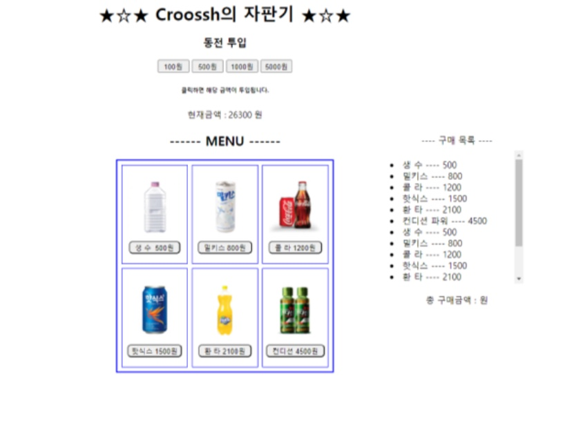

# 🥤 웹 자판기 🍹 (반응형 웹)
### ✔ 배포 주소 → https://croossh.github.io/Web-VendingMachine/

#### <사용 방법>
1. 금액 투입
2. 음료 선택
3. 장바구니 확인 👉 구매
4. 구매한 음료 및 총 금액 확인

#### <참고 사항>
✔ Vanilla Javascript 작성<br>
✔ 모바일 및 웹 반응형<br>
✔ 장바구니 및 구매한 음료 합산 표시

### WHY Start?<br> 
✔ HTML의 기본 구조와 CSS(flex)에 익숙해지기 위해<br>
✔ javascript를 통한 DOM에 대한 이해<br>
✔ javascript ES6를 연습하고, 기본 문법에 대한 이해 증진<br>

# 회고
첫 프로젝트의 시작은 그림과 같이 만들었다.<br>
<br>

<br>
DOM에 대해서 알게 되었고, DOM을 건드리는 메서드들에 대해 공부하게 되었다.<br>
inline으로 css와 js 를 적용하는 방법을 배우게 되었다.<br>
~~파일분리를 할 줄 몰라서... 그냥 html 파일 안에다 때려박은것이다. ^^~~<br>
<br>
<br>
문제는... 기쁨도 잠시 금방 찾아왔다.<br>
### 1. 문제 - 장바구니 
음료를 클릭하고, 숫자를 더하거나 빼는건 큰 문제가 없었으나 클릭한 갯수를 장바구니에 보여주고싶었다.<br>
배열을 어떻게 다룰지 몰랐고, 특정 값만 뽑아서 써먹는 방법을 잘 몰랐었다.<br>
즉, Array 프로토타입의 메서드를 아~예 몰랐다고 해도 과언이 아니다.<br>
~~아! length는 알고있었지...~~
배열을 잘 몰랐던 나는 결국 저 상태에서 포기하고 말았다.<br>

### 해결
엘리스를 수강하면서 JS 기초에 대해 배우고, 객체, 배열등의 기본메서드들을 배우며 드디어 장바구니를 영역을 추가할 수 있게 되었다.<br>
음료 클릭시 장바구니 영역에 추가하고 배열에 push를 해준뒤 구매를 누를 때 구매영역에 요소하나하나를 꺼내서 총 구매영역에 뿌릴 수 있게 되었다.<br>

### 2. 문제 - 선택된 음료 정리해서 보여주기
욕심이 생겼다.<br>
음료 하나하나를 그때그때 보여주는게 아닌 사전에 배열에서 정렬을 한뒤 '음료Xn개' 형태로 보여주고 싶었다.
배열을 이름순으로 정렬하고 그 갯수를 세서 그 결과를 뿌려주면되지 않을까? <br>
~~응 안돼~~<br>
이름순으로 정렬하는 sort()까진 생각이 났으나 갯수를 세는 짱구가 절대 생각나지 않았다.<br>
지금 생각해보면 filter 함수나 간단한 for문으로도 만들 수 있었지 않았을까...

### 해결
```javascript
const getHowMany = (arr) => {
  let goal = {};
  for (el of arr) {
    goal[el] = (goal[el] || 0) + 1;
  }
  return goal;
};
```
결국 for...of 문으로 완성을 시켰고 이는 reduce메서드로도 만들 수 있었으나... reduce 더할때만 써먹어봤지... 어려웠다.<br>
아무튼! 배열의 중복 갯수를 확인해줄 수있는 간단한 로직을 설계하고 함수로 만들어서 버튼 클릭시마다 재 랜더링 되게 만들었다.<br>
```javascript
let test = getHowMany(buyingArray);
  let come = "";
  for (i in test) {
    come += `<li>${i} X ${test[i]}</li>`;
  }
```
배열 중복 갯수를 확인하고, list 로 come에 차곡차곡 쌓은뒤에 innerHTML을 통해 보여주었다.<br>

### 3. 문제 - css 어떻게 꾸밀까?
아무리 하드코딩, 스스로 해낸 뿌듯함이 있다고 하더라도 보기좋은 떡이 먹기 좋은법.<br>

### 해결
무료이미지도 가져와서 메인 배너를 만들고, 다양한 animation, transition, translate를 경험하면서 이쁘게 만들었다.<br>
처음엔 색 조합이 너무 구린거같아서 https://color.adobe.com/ko/create/color-wheel 의 도움을 받아 이쁜 색 조합을 찾을 수 있었다.<br>
<br>
반응형 웹으로 만들기 위해 미디어 쿼리를 적용했고, 처음엔 불필요한 요소까지 모두 다시 적용하느라고 애썼지만 시행착오를 겪어서 필요한 부분만 뽑아서 미디어쿼리를 먹일 수 있는 방법을 찾았다.<br>
일단 길이같은 경우는 고정된 px보다 rem이나, 퍼센트(%)를 쓰면 반응형을 만들때 노고가 훨~~~~~~~~~~~~~~~~씬 적게 들어간다!<br>
row로 지정된 flex를 세로로 colunm으로 만들어주기만 하면 다른 영역들은 알아서 이쁘게 정렬된다.<br>

# 느낀점
1. 아무런 라이브러리나 프레임워크 도움 없이 하는 하드코딩이 진짜 확실히 짜릿한 것 같다.
2. 백문이 불여일견 직접 뭐든 해봐야 체득이 되고 내것이 되는걸 깨달았다.
3. 사실 포기하고 버려두던 프로젝트였는데 끝까지 포기하지않고 매달리니 정말 이쁘고 뿌듯한 미니프로젝트를 완성할 수 있었다!! 아자!
